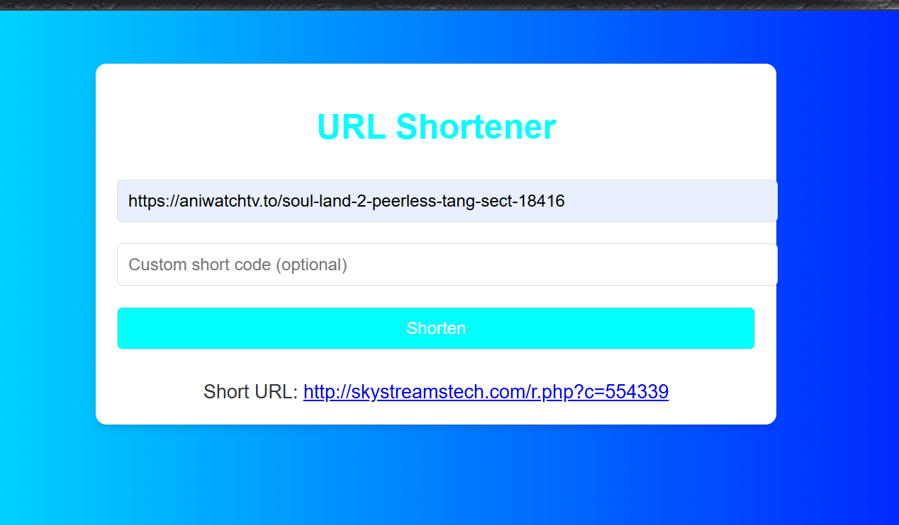

# URL Shortener

A simple, colorful URL shortener built with PHP and SQL. This application allows users to shorten URLs, create custom short codes, and track analytics like visit counts.

---

## Features
- **URL Shortening**: Generate short URLs for any valid long URL.
- **Custom Short Codes**: Users can specify custom short codes for their URLs.
- **Analytics**: Track the number of times a short URL has been accessed.
- **Responsive Design**: A user-friendly and colorful interface.

---

## Technologies Used
- **Frontend**: HTML, CSS, JavaScript
- **Backend**: PHP
- **Database**: MySQL

---

## Installation

### 1. Prerequisites
- A PHP-compatible web server (e.g., Apache, Nginx)
- MySQL database server
- Composer (optional, if dependencies are added later)

### 2. Setup
1. Clone the repository:
   ```bash
   git clone https://github.com/yourusername/url-shortener.git
   cd url-shortener
   ```

2. Import the database:
   - Open `database.sql` in a SQL client or MySQL command-line and execute it to create the necessary table.

3. Configure database connection:
   - Open `config.php` and update the database credentials:
     ```php
     $host = 'localhost';
     $db = 'url_shortener';
     $user = 'root';
     $pass = 'yourpassword';
     ```

4. Upload files to your server:
   - Place all project files in your server's public directory (e.g., `/var/www/html`).

5. Set up a domain (optional):
   - Configure your server to point to the project directory.

---

## Usage
1. Open the application in your web browser.
   - Example: `http://yourdomain.com/`

2. Shorten URLs:
   - Enter a long URL in the input field.
   - Optionally, specify a custom short code.
   - Click **Shorten** to generate the short URL.

3. Analytics:
   - Use the `analytics.php` endpoint to get analytics for a specific short URL.
   - Example: `http://yourdomain.com/analytics.php?code=shortcode`

4. Redirect:
   - Share the generated short URL.
   - Visitors will be redirected to the original URL.

---

## Folder Structure
```plaintext
url-shortener/
├── index.php         # Frontend UI
├── config.php        # Database configuration
├── shorten.php       # URL shortening logic
├── redirect.php      # URL redirection logic
├── analytics.php     # Analytics endpoint
├── delete.php        # Delete short URLs (optional)
├── style.css         # Styling for the UI
├── scripts.js        # Frontend interactivity
├── database.sql      # SQL file for table creation
└── README.md         # Project documentation
```

---

## API Endpoints
### **1. Shorten URL**
- **Endpoint**: `/shorten.php`
- **Method**: `POST`
- **Payload**:
  ```json
  {
    "url": "https://example.com",
    "custom_code": "mycustomcode" // Optional
  }
  ```
- **Response**:
  ```json
  {
    "short_url": "http://yourdomain.com/shortcode"
  }
  ```

### **2. Redirect URL**
- **Endpoint**: `/redirect.php?code=shortcode`

### **3. Analytics**
- **Endpoint**: `/analytics.php?code=shortcode`
- **Response**:
  ```json
  {
    "original_url": "https://example.com",
    "visit_count": 10,
    "created_at": "2025-01-01 12:00:00"
  }
  ```

---

## Screenshots

---

## License
This project is licensed under the MIT License. See the [LICENSE](LICENSE) file for details.

---

## Contributing
Feel free to fork the repository and submit pull requests for enhancements or bug fixes.
